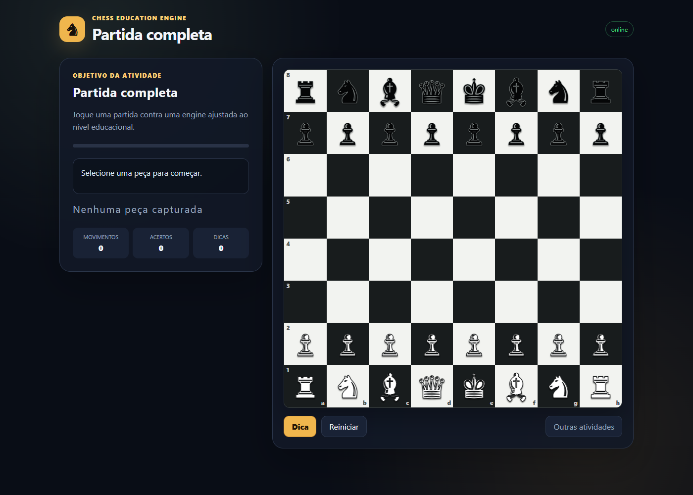

# Chess Education Engine

Motor educacional de xadrez, determinístico e orientado a domínio, para criar desafios, validar lances, acompanhar objetivos pedagógicos e executar partidas contra uma engine de dificuldade controlada.

O backend é a autoridade sobre regras, estado da sessão, progresso e resposta da engine. As interfaces web apenas apresentam o estado recebido e enviam as ações do estudante.



## Visão geral

O projeto foi construído para ensino e prática deliberada, não para competir com engines profissionais. A prioridade é oferecer regras corretas, feedback previsível, atividades extensíveis e uma API que possa ser consumida por diferentes plataformas de aprendizagem.

Principais recursos:

- regras oficiais encapsuladas por `ChessRulesEngine`, com implementação baseada em `shakmaty`;
- validação de FEN, movimentos legais, capturas, xeque, mate, afogamento, roque, promoção e *en passant*;
- suporte aos dados necessários para repetição de posição e regra dos cinquenta movimentos;
- desafios configuráveis por JSON, sem criar uma rota ou tela para cada exercício;
- objetivos pedagógicos compostáveis, dicas progressivas e feedback estruturado;
- treino de peças, táticas, sequências, promoção, jogo livre e partida contra bot;
- engine educacional com negamax, poda alpha-beta e limites de profundidade e tempo;
- sessões isoladas por UUID, histórico de lances, métricas e progresso;
- REST e gRPC sobre o mesmo serviço de aplicação;
- catálogo web separado e tabuleiro servido pelo próprio microsserviço;
- imagem Docker multi-stage, usuário sem privilégios, filesystem somente leitura e healthcheck;
- testes unitários, de propriedade, integração HTTP, PERFT e benchmarks.

## Arquitetura

### Contexto do sistema

```text
┌──────────────────────────┐
│ Catálogo web estático    │
│ atividades e modalidades │
└────────────┬─────────────┘
             │ POST /api/v1/sessions
             ▼
┌──────────────────────────────────────────────────────┐
│ Chess Education Engine                               │
│                                                      │
│  REST :8080 ─┐                                       │
│              ├──► SessionService ──► domínio         │
│  gRPC :50051 ┘            │                          │
│                           └──► SessionRepository      │
│                                                      │
│  GET /play/{id} ──► tabuleiro web da sessão          │
└──────────────────────────────────────────────────────┘
```

O catálogo cria uma sessão e recebe um `ui_url`. Ao abrir essa URL, o navegador carrega o tabuleiro correspondente e passa a interagir diretamente com o contrato REST. Outros consumidores podem usar REST ou gRPC sem depender da interface web.

### Camadas internas

```text
                         ┌─────────────────────────────┐
                         │ chess-api                   │
                         │ Axum · Tonic · assets web   │
                         └──────────────┬──────────────┘
                                        │
                         ┌──────────────▼──────────────┐
                         │ chess-session               │
                         │ casos de uso e persistência │
                         └───────┬───────────┬─────────┘
                                 │           │
                 ┌───────────────▼───┐   ┌───▼──────────────┐
                 │ chess-education   │   │ chess-engine     │
                 │ exercícios,      │   │ busca limitada e │
                 │ objetivos e dicas│   │ avaliação        │
                 └───────────────┬───┘   └───┬──────────────┘
                                 │           │
                                 └─────┬─────┘
                                       ▼
                         ┌─────────────────────────────┐
                         │ chess-core                  │
                         │ tipos, regras e Shakmaty    │
                         └─────────────────────────────┘
```

As dependências apontam para o domínio. `chess-core` não conhece HTTP, gRPC, HTML ou repositórios; `chess-api` é a camada externa que compõe os adaptadores concretos.

| Componente | Responsabilidade |
|---|---|
| `chess-core` | Tipos de domínio, representação da posição e contrato `ChessRulesEngine`. |
| `chess-education` | Fábrica de exercícios, geradores de posição, objetivos, avaliação e dicas. |
| `chess-engine` | Escolha de lances da engine educacional sob limites rígidos. |
| `chess-session` | Casos de uso, estado, métricas e contrato `SessionRepository`. |
| `chess-api` | Adaptadores REST/gRPC, composição da aplicação e assets do tabuleiro. |
| `web` | Catálogo estático que seleciona atividades e cria sessões. |
| `proto` | Contrato público do serviço gRPC. |

### Fluxo de uma jogada

```text
Navegador
   │  POST /sessions/{id}/moves
   ▼
REST adapter
   │
   ▼
SessionService
   ├── carrega a sessão pelo SessionRepository
   ├── consulta o estado em ChessRulesEngine
   ├── valida e aplica o movimento
   ├── avalia o objetivo em ExerciseValidator
   ├── solicita a resposta de ChessAi, quando configurada
   ├── atualiza histórico, métricas e duração
   └── persiste o novo estado
   │
   ▼
Resposta estruturada: posição, feedback, objetivo e movimentos legais
```

Uma instância de `SessionService` é compartilhada pelos adaptadores REST e gRPC. Isso evita regras duplicadas nas camadas de transporte e mantém o comportamento consistente entre protocolos.

## Estrutura do repositório

```text
chess-education-engine/
├── crates/
│   ├── chess-core/
│   ├── chess-education/
│   ├── chess-engine/
│   ├── chess-session/
│   ├── chess-api/
│   └── chess-web/          # HTML, CSS e JavaScript embutidos na API
├── docs/images/            # imagens usadas na documentação
├── examples/               # atividades declarativas de exemplo
├── proto/chess.proto       # contrato gRPC
├── web/                    # catálogo estático de atividades
├── Dockerfile
└── docker-compose.yml
```

## Tecnologias

- Rust 2024 e Tokio;
- Axum para HTTP/REST;
- Tonic e Protocol Buffers para gRPC;
- `shakmaty` para regras de xadrez;
- Serde para contratos JSON;
- `tracing` e `tracing-subscriber` para logs estruturados;
- HTML, CSS e JavaScript sem framework no cliente;
- Docker e Nginx para execução local do catálogo.

## Início rápido com Docker

Requisito: Docker com Compose.

```bash
docker compose up --build
```

Serviços disponíveis:

| Serviço | Endereço |
|---|---|
| Catálogo de atividades | `http://localhost:4173` |
| API REST e tabuleiro | `http://localhost:8080` |
| Healthcheck | `http://localhost:8080/health` |
| Readiness | `http://localhost:8080/ready` |
| gRPC | `localhost:50051` |

Para encerrar:

```bash
docker compose down
```

O Compose executa a API com filesystem somente leitura e `no-new-privileges`. O catálogo é servido por Nginx com o diretório web montado como somente leitura.

## Desenvolvimento local

Requisitos:

- Rust 1.95 ou superior;
- Node.js para servir o catálogo estático;
- no Windows com toolchain MSVC, Visual C++ Build Tools.

API e tabuleiro:

```bash
cargo run --release -p chess-api
```

Em outro terminal, catálogo de atividades:

```bash
cd web
npm run dev
```

O catálogo usa `CHESS_API_URL=http://localhost:8080` como padrão.

## Configuração

As variáveis estão documentadas em `.env.example`.

| Variável | Padrão | Responsabilidade |
|---|---:|---|
| `PORT` | `8080` | Porta HTTP quando `HTTP_ADDR` não está definido. |
| `HTTP_ADDR` | — | Endereço HTTP completo; tem prioridade sobre `PORT`. |
| `GRPC_ADDR` | `0.0.0.0:50051` | Endereço do servidor gRPC. |
| `RUST_LOG` | `chess_api=info,tower_http=info` | Filtro dos logs estruturados. |
| `FRONTEND_ORIGIN` | origens locais | Lista de origens permitidas no CORS, separadas por vírgula. |
| `PUBLIC_API_URL` | — | Base pública usada para construir `ui_url`. |
| `CHESS_API_URL` | `http://localhost:8080` | Base da API gravada na configuração do catálogo. |

Em um ambiente publicado, configure explicitamente `FRONTEND_ORIGIN` e `PUBLIC_API_URL`, encerre TLS no gateway ou proxy reverso e exponha somente as portas necessárias.

## API REST

### Criar uma sessão

```bash
curl -X POST http://localhost:8080/api/v1/sessions \
  -H "Content-Type: application/json" \
  -d '{
    "mode": "exercise",
    "exercise": {
      "type": "checkmate",
      "difficulty": "beginner",
      "max_moves": 1
    }
  }'
```

A resposta contém `session_id`, posição FEN, objetivo, movimentos legais, configuração da interface e `ui_url`.

### Executar um movimento

```bash
curl -X POST http://localhost:8080/api/v1/sessions/SEU_UUID/moves \
  -H "Content-Type: application/json" \
  -d '{"from":"g6","to":"g7","promotion":null}'
```

O resultado informa se o lance é válido, a nova posição, o estado do objetivo, as métricas, o feedback e, quando aplicável, o lance da engine.

### Rotas

| Método | Rota | Finalidade |
|---|---|---|
| `GET` | `/` | Informações básicas do serviço. |
| `GET` | `/health` | Confirma que o processo está ativo. |
| `GET` | `/ready` | Confirma que o serviço está pronto. |
| `GET` | `/play/{id}` | Carrega o tabuleiro de uma sessão. |
| `POST` | `/api/v1/sessions` | Cria uma sessão. |
| `GET` | `/api/v1/sessions/{id}` | Consulta o estado atual. |
| `POST` | `/api/v1/sessions/{id}/moves` | Valida e aplica um lance. |
| `POST` | `/api/v1/sessions/{id}/hint` | Retorna uma dica progressiva. |
| `POST` | `/api/v1/sessions/{id}/reset` | Reinicia a atividade. |
| `DELETE` | `/api/v1/sessions/{id}` | Remove a sessão. |

Os erros públicos são estruturados e não expõem detalhes internos. Textos de feedback usam `message_key` e variáveis, permitindo que tradução e conteúdo editorial permaneçam fora do domínio.

## gRPC

O contrato está em `proto/chess.proto` e oferece criação, consulta, movimento, dica, reinício e remoção de sessões.

```bash
grpcurl -plaintext \
  -import-path proto \
  -proto chess.proto \
  -d '{"mode":"exercise","exercise_type":"checkmate","difficulty":"beginner","max_moves":1}' \
  localhost:50051 \
  chess.education.v1.ChessEducation/CreateSession
```

Configurações completas podem ser enviadas em `request_json` usando o mesmo documento aceito pela API REST.

## Exercícios dirigidos por dados

Uma nova atividade pode combinar posição, objetivo, dificuldade e regras sem introduzir endpoints específicos:

```json
{
  "mode": "exercise",
  "position": {
    "fen": "4k3/8/8/8/8/8/4P3/4K3 w - - 0 1"
  },
  "objective": {
    "type": "move_piece",
    "piece": "pawn",
    "target": "e4"
  },
  "difficulty": "beginner"
}
```

Arquivos completos estão disponíveis em `examples/`.

Objetivos suportados pelo contrato:

- `checkmate`;
- `check`;
- `capture`;
- `move_piece`;
- `reach_square`;
- `promote`;
- `escape_check`;
- `win_material`;
- `survive`;
- `best_move`;
- `complete_sequence`;
- `play_full_game`.

## Engine educacional

`SimpleEngine` implementa busca negamax com poda alpha-beta e avaliação material. A dificuldade controla profundidade, tempo máximo e alternativas aceitáveis.

A busca é executada fora do executor assíncrono principal por meio de `spawn_blocking` e possui timeout externo. Isso impede que uma análise mais longa bloqueie o servidor HTTP.

O objetivo dessa engine é produzir oposição adequada ao nível do estudante. Evoluções como tabelas peça-casa, quiescence, ordenação de movimentos, *transposition table* e Zobrist hashing devem ser orientadas por benchmark.

## Extensibilidade

### Adicionar um objetivo

1. Adicione a variante a `ObjectiveSpec` em `chess-education/src/model.rs`.
2. Implemente a avaliação em `DefaultObjectiveEvaluator` ou em outro `ExerciseValidator`.
3. Cubra progresso, conclusão e falha com testes.
4. Passe o novo `type` na definição JSON; o transporte não precisa mudar.

### Adicionar um gerador de posição

1. Implemente `PositionGenerator`.
2. Gere ou transforme templates por rotação, espelhamento ou troca de cores.
3. Valide o resultado com `ChessRulesEngine::validate_position`.
4. Registre o gerador na fábrica de exercícios.

### Adicionar persistência

Implemente `SessionRepository` em `chess-session` e substitua somente o adaptador na função `application_service()`. Um adaptador distribuído deve incluir TTL e controle de concorrência por sessão para evitar perda de atualização.

### Adicionar uma modalidade

Modele a modalidade como composição de posição, objetivo, regras e oponente. Um novo `ExerciseType` só é necessário quando existe uma semântica de domínio própria; handlers HTTP específicos devem ser evitados.

## Segurança e operação

- payload REST limitado a 32 KiB;
- FEN, casas e movimentos validados no domínio;
- UUID v4 para identificação das sessões;
- limite de movimentos por exercício;
- busca limitada por profundidade, duração e timeout;
- CORS por lista explícita de origens;
- erros públicos sem stack trace;
- imagem de runtime sem toolchain de compilação;
- usuário sem privilégios no container;
- filesystem somente leitura no Compose;
- `x-request-id` criado ou propagado na camada HTTP;
- logs JSON por `tracing`;
- nenhuma credencial ou chave de modelo é enviada ao navegador.

Rate limiting deve ser aplicado no gateway, proxy reverso ou em uma camada Tower dedicada, conforme os requisitos do ambiente. A engine não armazena dados pessoais.

## Estado e escalabilidade

O adaptador atual é `InMemorySessionRepository`. Consequências:

- sessões não sobrevivem ao reinício do processo;
- cada réplica possui seu próprio conjunto de sessões;
- o modo padrão é indicado para desenvolvimento, demonstração e execução com uma única instância.

Para múltiplas réplicas ou sessões duráveis, implemente um repositório compartilhado pelo contrato existente. REST, gRPC, domínio e frontend permanecem inalterados.

## Testes e qualidade

```bash
cargo fmt --all --check
cargo clippy --workspace --all-targets -- -D warnings
cargo test --workspace
cargo build --release --locked
```

Também é possível executar os testes no mesmo ambiente Linux usado no build:

```bash
docker run --rm -v "$PWD:/app" -w /app rust:1.97-bookworm cargo test --workspace
```

A suíte cobre:

- posição inicial e movimentos legais;
- movimentos ilegais;
- roque, *en passant* e promoção;
- xeque-mate e afogamento;
- PERFT da posição inicial até profundidade 3 (`20`, `400`, `8902`);
- propriedade de que todo movimento legal aplicado produz outra posição válida;
- objetivos, dicas e isolamento de sessões;
- fluxo completo da API REST.

## Benchmarks

```bash
cargo bench -p chess-core
```

O benchmark Criterion mede parsing FEN, geração de movimentos legais e aplicação de movimentos. Otimizações devem começar por uma medição reproduzível.

## Decisões de projeto

- `shakmaty` permanece atrás de `ChessRulesEngine`;
- estruturas internas como bitboards não aparecem nos contratos públicos;
- o frontend não replica regras de xadrez;
- REST e gRPC compartilham casos de uso e estado;
- atividades são preferencialmente descritas por dados;
- uma integração futura com LLM pode selecionar ou explicar atividades, mas não validar lances nem decidir mate;
- o MVP evita infraestrutura que não seja necessária ao problema, como Kafka, Kubernetes, CQRS ou banco obrigatório.

